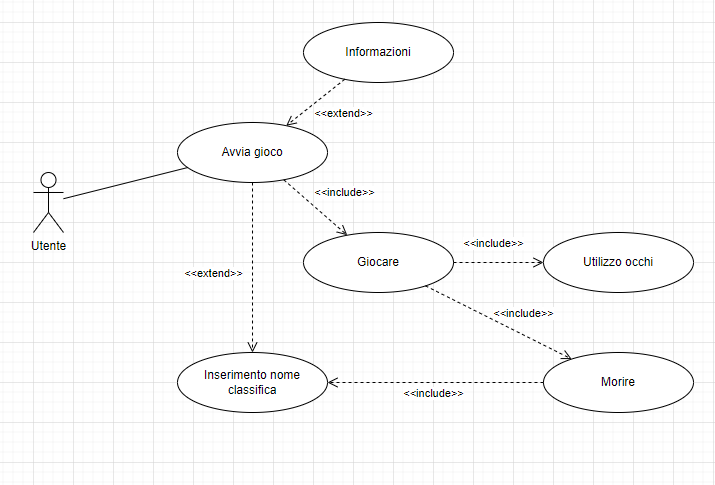
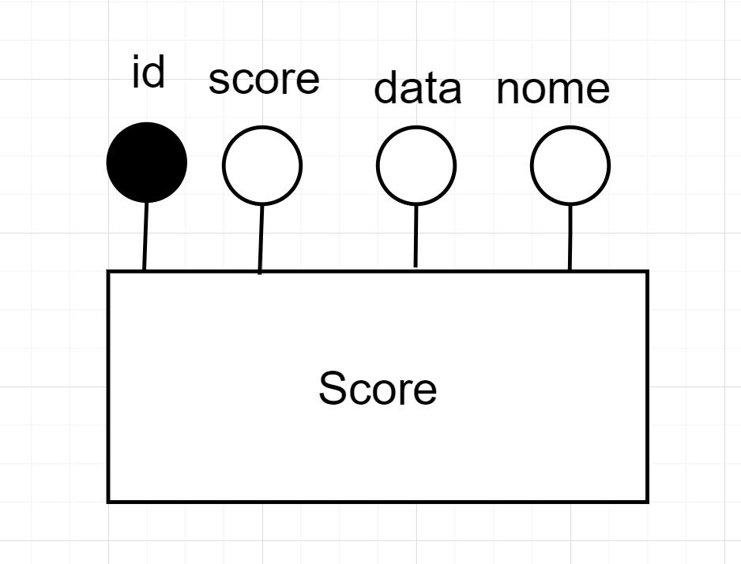
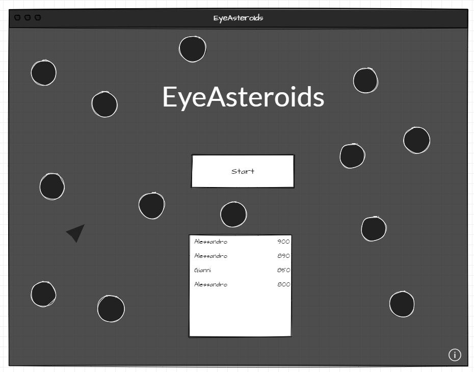
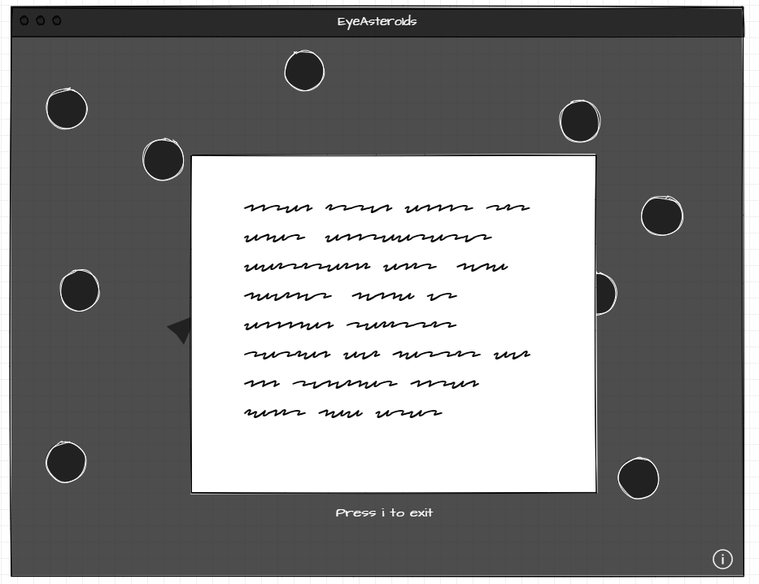
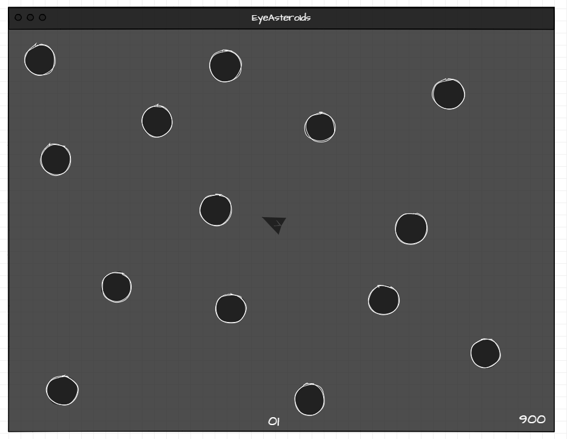
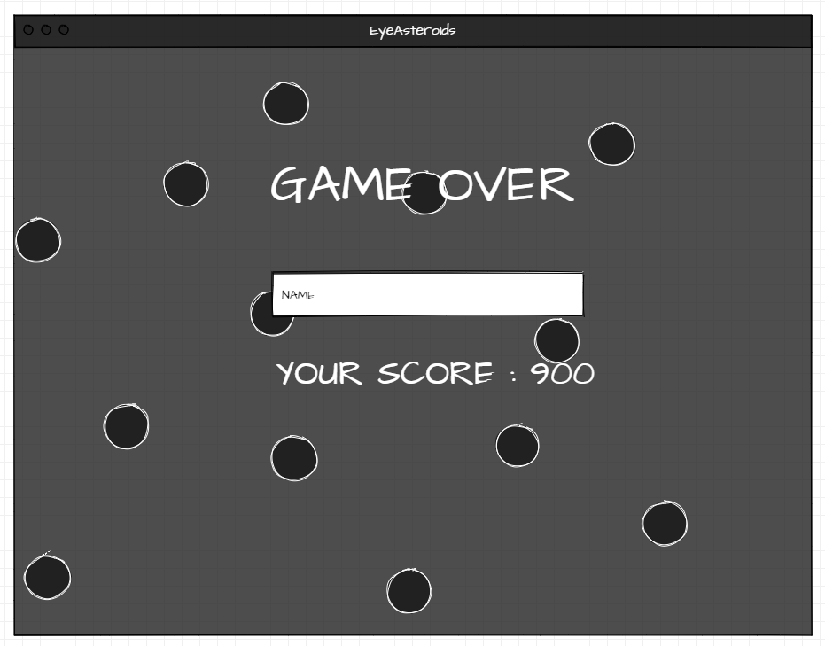
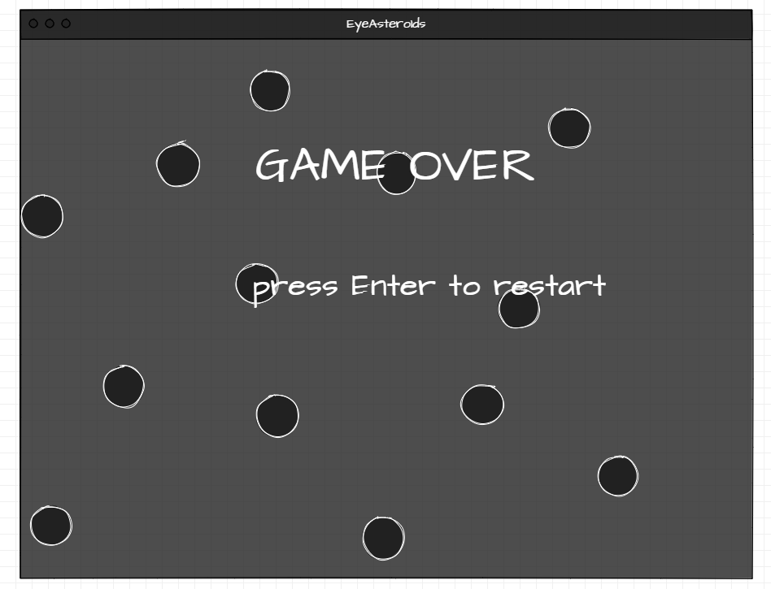
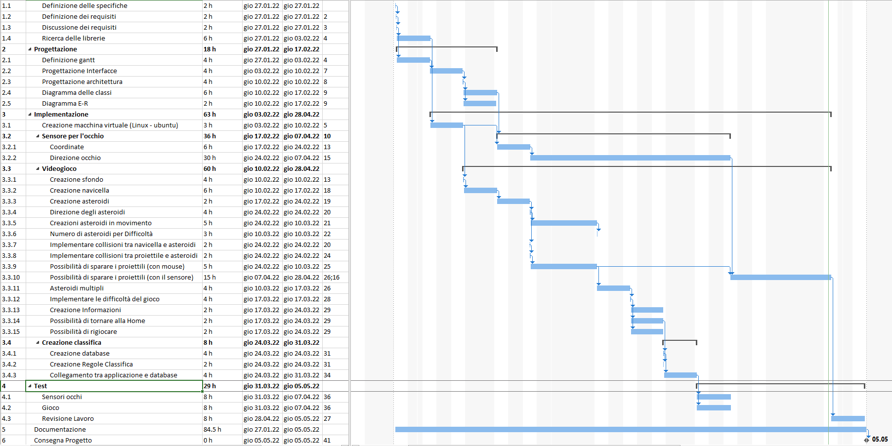

1. [Introduzione](#introduzione)

  - [Informazioni sul progetto](#informazioni-sul-progetto)

  - [Abstract](#abstract)

  - [Scopo](#scopo)

1. [Analisi](#analisi)

  - [Analisi del dominio](#analisi-del-dominio)

  - [Analisi dei mezzi](#analisi-dei-mezzi)

  - [Analisi e specifica dei requisiti](#analisi-e-specifica-dei-requisiti)

  - [Use case](#use-case)

  - [Pianificazione](#pianificazione)

1. [Progettazione](#progettazione)

  - [Design dell’architettura del sistema](#design-dell’architettura-del-sistema)

  - [Design dei dati e database](#design-dei-dati-e-database)

1. [Implementazione](#implementazione)

1. [Test](#test)

  - [Protocollo di test](#protocollo-di-test)

  - [Risultati test](#risultati-test)

  - [Mancanze/limitazioni conosciute](#mancanze/limitazioni-conosciute)

1. [Consuntivo](#consuntivo)

1. [Conclusioni](#conclusioni)

  - [Sviluppi futuri](#sviluppi-futuri)

  - [Considerazioni personali](#considerazioni-personali)

1. [Sitografia](#sitografia)

1. [Allegati](#allegati)


## Introduzione

### Informazioni sul progetto
- Allievi coinvolti nel progetto: Alessandro Aloise, Mattia Pasquini, Alessandro Castelli
- Classe: I3AA e I3BB, Scuola Arti e Mestieri Trevano, sezione Informatica.
- Docenti responsabili: Luca Muggiasca.
- Data inizio: 27 gennario 2022
- Data di fine: 05 maggio 2022.

### Abstract

> *Everyone at least once has heard of the famous retro game Asteroids. Today more than ever we are returning to fashion retro games, it often happens to hear of new game rooms that are opened with the presence of cabinets. For this reason we want to give a touch of novelty to a game that has made history. For this reason we decided to create this version of the game where you will no longer have to move the ship with the classic knob but simply with the look. This version does not want to change anything in terms of graphics compared to the original in fact it will be as faithful as possible to the original.Our product will be a more technological and advanced version of the original videogame, but to keep the originality we decided to have a dedicated machine with a ranking like the real game on which you can play one at a time and try to improve your score.*

### Scopo

Lo scopo del progetto è di creare un videogame che riprenda l’iconico Asteroids, nel quale una navicella posta al centro dello schermo non deve farsi colpire dagli asteroidi che si avvicinano a lei. La navicella potrà solamente ruotare su se stessa. La particolarità di questa versione del gioco sarà che la navicella dovrà essere guidata con gli occhi dal giocatore.


## Analisi

### Analisi del dominio

È stato richiesto di creare il videogame Asteroids che dovrà essere giocato tramite gli occhi. La navicella deve essere fissa al centro e poter sparare tramite lo sguardo del giocatore inoltre. Il videogame deve contere una classifica come il gioco origine. Deve inoltre essere presenti vari livelli di difficoltà, in fine devono essere presenti vari tipi di asteroidi.

  Deve essere inoltre allestita una macchina dedicata per il suo corretto funzionamento e in modo che più persone possano giocarci.


### Analisi e specifica dei requisiti
|              |**ID: Req-001**                       |
|--------------|--------------------------------------|
|**Nome**      |La navicella deve ruotare su se stessa|
|**Priorità**  | 1                                    |
|**Versione**  | 1.1                                  |
|**Note**      | Sempre al centro del frame           |

|              |**ID: Req-002**                           |
|--------------|------------------------------------------|
|**Nome**      |Poter saprare con lo sguardo sparo singolo|
|**Priorità**  | 1                                        |
|**Versione**  | 1.1                                      |
|**Note**      |                                          |

|              |**ID: Req-003**              |
|--------------|-----------------------------|
|**Nome**      |Poter sparare con la tastiera|
|**Priorità**  | 2                           |
|**Versione**  | 1.1                         |
|**Note**      | (extra)                     |

|              |**ID: Req-004**                           |
|--------------|------------------------------------------|
|**Nome**      |Diverse difficoltà in base al tempo.      |
|**Priorità**  | 1                                        |
|**Versione**  | 1.1                                      |
|**Note**      | Più il tempo passa più diventa difficile |

|              |**ID: Req-005**                      |
|--------------|-------------------------------------|
|**Nome**      |Essere fedele alla versione originale|
|**Priorità**  | 2                                   |
|**Versione**  | 1.1                                 |
|**Note**      | (extra)                             |

|              |**ID: Req-006**                             |
|--------------|--------------------------------------------|
|**Nome**      |Avere un database dove salvare la classifica|
|**Priorità**  | 2                                          |
|**Versione**  | 1.1                                        |
|**Note**      | Ci può essre più volte lo stesso nome      |

|              |**ID: Req-007**                    |
|--------------|-----------------------------------|
|**Nome**      |Generare gli asteroidi in movimento|
|**Priorità**  | 1                                 |
|**Versione**  | 1.1                               |
|**Note**      |  |

|              |**ID: Req-008** |
|--------------|----------------|
|**Nome**      |Punteggio       |
|**Priorità**  | 1              |
|**Versione**  | 1.1            |
|**Note**      |                |

|              |**ID: Req-009**  |
|--------------|-----------------|
|**Nome**      |Macchina dedicata|
|**Priorità**  | 1               |
|**Versione**  | 1.1             |
|**Note**      |                 |

|              |**ID: Req-010**            |
|--------------|---------------------------|
|**Nome**      |Asteroidi multipli         |
|**Priorità**  | 1                         |
|**Versione**  | 1.1                       |
|**Note**      | Più tipolgie di asteroidi |


|              |**ID: Req-011**                 |
|--------------|--------------------------------|
|**Nome**      |Porter rigiocare                |
|**Priorità**  | 2                              |
|**Versione**  | 1.1                            |
|**Note**      | Poter fare una seconda partita |


|              |**ID: Req-012**                        |
|--------------|---------------------------------------|
|**Nome**      |Classifica                             |
|**Priorità**  | 2                                     |
|**Versione**  | 1.1                                   |
|**Note**      |Ci può essere più volte lo stesso nome.|


### Use case
Ecco il nostro Use Case:

> Use case


### Pianificazione

Per la pianificazione alleghiamo il Gantt preventivo da noi stabilito:

> Gantt preventivo

Come si può notare abbiamo deciso di dediare molto tempo a come sparare con gli occhi dato che é una cosa che non abbiamo mai fatto abbiamo ritenuto opportuno dare questa quantità di tempo.
### Analisi dei mezzi

**Software**
- Python
- GazeTracking
- Pygame

**Hardware**
- Laptop personali
- PC scolastici
- PC dato dai sistemisti
- Webcam

## Progettazione
### Design dei dati e database
La prima versione del databse conteneva due tabelle una player e una score ma in fase di implementazione ci siamo accorti che era davvero inutile avere due tabelle quindi abbiamo deciso di tenerne solo una e di fargli qualche modifica :

> Database

Tutti i dati vengono salvati in questa tabella `Score` con gli attributi id, score, data e nome. I dati vengono aggiunte ogni fine partita, e poi il gioco estrae i dati per mostrare la classifica ordinata dal punteggio più alto. Abbiamo deciso salvare anche la data per eventuali sviluppi futuri e statistiche aggiuntive.


### Design delle interfacce

### Schermata Home
La prima interfaccia che abbiamo definito è stata quella generale, ovvero l'interfaccia che l'utente avrebbe visto una volta avviato il gioco:

> Schermata home

La schermata principale, che mostra il bottone "Start" per iniziare la partita, in questa schermata c'è anche la classifica ordinata in funzione del punteggio. E sopra il bottone c'è il totolo del gioco, ossia "EyeAsteroids". Quando si è in questa schermata c'è la possibilità di utilizzare due tasti, uno per giocare e altro per avere le informazioni del gioco.


### Schermata Info

> Schermata info

In questo schermo mostra le informazioni necessarie del gioco, cercando di mantenere lo stesso stile usato nel resto del gioco. Per tornare alla pagina principale si deve premere un tasto indicato.


### Schermata di gioco

> Schermata di gioco

Quando un utente vuole iniziare la partita viene mostrata questo schermata. Abbiamo cercato di rispettare il gioco originale. Ci sono molti asteroidi in movimento disperse nella superficie e la navicella sta in centro cercando di distruggere tutti gli asteroidi ruotando se stesso. In questa schermata viene mostrato i punteggi fatti nel corso della partita.

### Schermata Classifica

> Schermata dove inserire il nome per la classifica

Abbiamo pensato a una schermata molto pulita e intuitiva per quanto riguarda la classifica. Come si può vedere c'é solo un label dove inserire il nome con sotto il proprio punteggio fatto nella partita. E sopra il label c'è scritto "Game over" per indicare che la partita è finita.


> Schermata game over

Una volta inserito il nome, si mostra questa schermata mantenendo il scritto "Game over" e gli indicazioni dei tasti dove se si vuole giocare ancora una partita oppure andare nella schermata principale (home).


## Implementazione

In questo capitolo dovrà essere mostrato come è stato realizzato il
lavoro. Questa parte può differenziarsi dalla progettazione in quanto il
risultato ottenuto non per forza può essere come era stato progettato.

Sulla base di queste informazioni il lavoro svolto dovrà essere
riproducibile.

In questa parte è richiesto l’inserimento di codice sorgente/print
screen di maschere solamente per quei passaggi particolarmente
significativi e/o critici.

Inoltre dovranno essere descritte eventuali varianti di soluzione o
scelte di prodotti con motivazione delle scelte.

Non deve apparire nessuna forma di guida d’uso di librerie o di
componenti utilizzati. Eventualmente questa va allegata.

Per eventuali dettagli si possono inserire riferimenti ai diari.

### Classe Game

Questa classe rappresenta gli oggetti presenti nel gioco in modo generico, che verrà ereditato dagli altri oggetti nel gioco.

Questa classe necessita la posizione con le coordinate, lo sprite per definire l'immagine, il raggio ottenendo la metà larghezza dell'immagine e infine la velocità.

La posizione dell'oggetto non viene definito le coordinate in alto e sinistra dell'immagine come default, ma viene definito le coordinate nel centro dell'immagine per semplificare eventuali rotazioni e collisioni tra gli oggetti che sono a forma del cerchio (per esempio asteroide)che viene implementato manualmente creando la funzione `collides_with()` siccome che nella libreria pygame non c'è.

Il metodo `draw(surface)` serve per stampare l'oggetto calcolando la posizione dell'oggetto sottrando il raggio:
```py
def draw(self, surface):
    blit_position = self.position - Vector2(self.radius)
    surface.blit(self.sprite, blit_position)
```


Mentre il metodo `move()` aggiorna la posizione dell'oggetto sommando il valore della velocità:
```py
def move(self):
    self.position = self.position + self.velocity
```


E infine il metodo `collides_with(other_obj)` calcola la collisione tra gli oggetti, calcolando se la distanza tra loro utilizzando la funzione `distance_to()` è più piccolo della somma dei raggi di entrambi oggetti:
```py
def collides_with(self, other_obj):
    distance = self.position.distance_to(other_obj.position)
    return distance < self.radius + other_obj.radius
```

### Classe Asteroid

Questa classe serve per definire gli asteroidi nel gioco ereditando la classe `Game`.

```py
def __init__(self, x, y, angle, select):
	random_sprite = [
	    ["asteroid0",100,250,4],
	    ["asteroid1",50,500,2],
	    ["asteroid2",20,750,1]
	]
	if select != 0:
	    self.sprite_name = random_sprite[0][0]
	    self.point = random_sprite[0][1]

	    # attributo per definire quanti secondi servono per distruggere l'asteroide
	    self.life = random_sprite[0][2]
	    self.speed = random_sprite[0][3]
	else:
	    rand = random.randint(0, 2)
	    self.sprite_name = random_sprite[rand][0]
            self.point = random_sprite[rand][1]

	    # attributo per definire quanti secondi servono per distruggere l'asteroide
            self.life = random_sprite[rand][2]
	    self.speed = random_sprite[rand][3]
	    self.x = x
	    self.y = y
	    self.position = Vector2(self.x, self.y)
	    super().__init__(
	        self.position, load_sprite(self.sprite_name), Vector2(self.speed, 0).rotate(angle)
	    )
```
In questa classe necessita lo sprite per definire l'immagine, il valore del punteggio, la vita e la velocità, tutto questo viene definito casualmente per ogni asteroide. Inoltre serve anche la posizione dell'asteroide e l'angolo per indicare la direzione in cui va l'asteroide siccome che il vettore y della velocità è 0. La variabile `select` serve a cambiare il tipo di asteroide da creare, questo per via della divisione degli asteroidi grandi che quando vengono distrutti si dividono in due più piccoli, quindi quando viene distrutto un asteroide grande non devono essere creati due asteroidi casuali.


### Classe Spaceship

Questa classe serve per definire la navicella nel gioco ereditando la classe `Game`.

Questa classe ha solo posizione che viene definito dal parametro del costruttore, lo sprite e la velocita che è 0, utilizzando il costruttore del superclasse.

Il metodo draw(surface) viene ridefinito (Override), stampa la navicella e ruota in base alle coordinate del giocatore che osserva lo schermo utilizzando la funzione `atan2()` moltiplicato per 180 e dividendo per la costante pigreco ottenendo l'angolo in gradi. Poi ruota l'immagine utilizzando la funzione `rotozoom()` con lo sprite e l'angolo per ottenere l'immagine ruotata e poi stamparlo:
```python
def draw(self, surface):
    position_spaceship_x, position_spaceship_y = self.position
    coordinate_x, coordinate_y = pygame.mouse.get_pos()

    angle = atan2(
        position_spaceship_y - coordinate_y,
        coordinate_x - position_spaceship_x
      ) * 180 / pi

    #ruota l'immagine
    rotated_surface = rotozoom(self.sprite, angle, 1.0)

    #coordinate dell'immagine ruotato
    blit_position = self.position - (Vector2(rotated_surface.get_size())/2)
    surface.blit(rotated_surface, blit_position)
```

### Classe Laser

Questa classe serve per definire il laser, che viene utilizzato dalla navicella per sparare contro gli asteroidi.
Non è necessario ereditare la classe `Game` perché non ha alcuna caratteristica simile rispetto ad altri oggetti presenti in questo gioco (collisioni, velocità e altro) se il laser viene rappresentato con una sola linea. Se fosse rappresentato come pallottola, in questo caso dovrebbe avere la necessità di ereditare la casse `Game`.

Questa classe necessita solamente il punto iniziale (in questo caso, centro).

Il metodo `draw(surface)` stampa la linea utilizzando il colore, il punto di partenza definito dall'attributo di questa classe, punto finale definito dalle coordinate del giocatore che osserva lo schermo e infine il parametro `width` che rappresenta lo spessore della linea.
```py
def draw(self, surface, coordinate):
    pygame.draw.line(surface, (255,255,255), self.start_point, coordinate, width=2)
```

### Classe Startgame

Questa classe serve per far eseguire il gioco, utilizzando la libreria Pygame.

Questa classe necessita diversi attributi:
- `screen`: display del gioco (impostato 1500 x 900, scelta arbitraria);
- `width`:  altezza del display del gioco;
- `height`: lunghezza del display del gioco;
- `clock`: oggetto `Clock` dalla libreria pygame.time;
- `status_webcam`: attributo booleana, indica se si vuole utilizzare la webcam o meno per il gioco;
- `coordinates`: Attributo che contiene due valori, la coordinata x e la coordinata y. Le coordinate viene definito dal mouse oppure dal webcam a dipendenza del valore dell'attributo `status_webcam`;
- `state_game`: stato dell'applicazione indicato dal suo valore:
  - Valore `0` indica la schermata iniziale (home);
  - Valore `1` indica la schermata del gioco (modalità gioco);
  - Valore `2` indica la schermata dove mostra le informazioni del gioco;
  - Valore `3` indica la schermata per inserire il nome per salvare il nickname e il punteggio nel database;
  - Valore `4` indica la schermata dove mostra la classifica (top 5) e il punteggio ottenuto dall'ultimo utente giocato.
 - `points`: punteggio del giocatore corrente;
 - `player`: nickname del giocatore corrente;
 - `spaceship`: oggetto `Spaceship`, inizializzata come `None`;
 - `asteroids`: lista degli oggetti `Asteroid`;
 - `last_time`: attributo per calcolare la durata della collisione tra punta del laser e l'asteroide, inizializzata come `None`;
 - `wait`: tempo di attesa tra lo spawn degli asteroidi;
 - `cancel_wait`: attributo che contiene la thread per lo spawn degli asteroidi.

Questa classe contiene tanti metodi:
- `_init_pygame()`: un metodo che inizializza pygame e imposta il titolo della finestra.
- `main_loop()`: questo metodo contiene un ciclo con la condizione `True`. In questo ciclo ci dev'essere il controllo del valore `state_game` e in base al suo valore, invoca un metodo che permette di stampare sulla schermata ed eventuali altri metodi.

```py
def main_loop(self):
    webcam = cv2.VideoCapture(0)
    width = webcam.get(cv2.CAP_PROP_FRAME_WIDTH)
    height = webcam.get(cv2.CAP_PROP_FRAME_HEIGHT)
    replay = 0
    while True:
        self.clock.tick(60)
        self._handle_input()
        self._change_status_webcam()

        if self.state_game == 0:
            # Stampa la schermata home
            self._draw_home()

        elif self.state_game == 1:
            # Stampa la schermata game e esegue la logica del gioco (movimenti degli oggetti, ...)
            if replay == 0:     
                _, frame = webcam.read()
                self.gaze.refresh(frame)
                replay = 1
            frame = self.gaze.annotated_frame()
            self._draw_game()
            self._process_game_logic()

	elif self.state_game == 2:
            # Stampa la schermata informazioni per mostrare il punteggio degli asteroidi
            self._draw_info()

	elif self.state_game == 3:
            # Stampa la schermata per inserire il nickname
            self._draw_insert_name()

        else:
            webcam.release()
            cv2.destroyAllWindows()
            # Stampa la schermata per mostrare la classifica dei punteggi dei giocatori
            self._draw_end()
```

- `_draw_home()`: metodo che stampa il titolo del gioco, sfondo e indicazioni dei tasti. (Prima cosa da eseguire in questo metodo è stampare lo sfondo nero).
- `_draw_game()`: stampa il gioco, ossia tutti gli oggetti (navicella, asteroidi e laser) e il punteggio. Il laser viene stampata solo se l'attributo `coordinates` si trova uno degli asteroidi nel gioco (viene utilizzata `_laser_collision()` che viene descritto uno dei prossimi punti) (prima cosa da eseguire in questo metodo è stampare lo sfondo nero).
- `_draw_info()`: stampa le informazioni del gioco (Valore dei punti degli asteroidi e i tasti) (prima cosa da eseguire in questo metodo è stampare lo sfondo nero).
- `_draw_insert_name()`: stampa il titolo "Game over", stampa una frase dove chiede di scrivere il nome del giocatore e stampa l'attributo `player` (viene aggiornato automaticamente dal metodo `_handle_input()`) e carattere underscore come il cursore (prima cosa da eseguire in questo metodo è stampare lo sfondo nero).
- `_draw_end()`: Stampa la classifica dei cinque migliori giocatori in funzione del punteggio fatto nel gioco e stampa il punteggio del giocatore corrente (prima cosa da eseguire in questo metodo è stampare lo sfondo nero).
- `_process_game_logic()`: esegue il movimento degli asteroidi (tramite `move()` in riferimento all'asteroide) e controlla la collisione tra asteroidi e navicella.
- `_laser_collision()`: controlla se il valore `coordinates` si trova uno degli asteroidi nel gioco (utilizzata dal metodo `_collide_any_asteroids()`), se questa condizione viene soddisfatta, stampa il laser e decrementa la vita dell'asteroide in funzione dei millisecondi passati. Se la vita dell'asteroide arriva a 0 o meno, aumenta il punteggio e l'asteroide viene distrutto e se quell'asteroide è quello grande, veongono generate altri due asteroidi partendo dalla stessa posizione.
```py
def _laser_collision(self):
    asteroid = self._collide_any_asteroid()
    if(asteroid != None):  
        self.laser.draw(self.screen, self.coordinates)
	if self.last_time == None:
	    self.last_time = pygame.time.get_ticks()

        now = pygame.time.get_ticks()
        delta = now - self.last_time;
        asteroid.life -= delta
        self.last_time = now
        if asteroid.life <= 0:
            self.points += asteroid.point
            if asteroid.point == 20:
                angle_1 = random.randint(0,360)
                angle_2 = random.randint(0,360)
                x,y = asteroid.position
                self.asteroids.append(Asteroid(x, y, angle_1, 1))
                self.asteroids.append(Asteroid(x, y, angle_2, 1))
            self.asteroids.remove(asteroid)
            del asteroid
    else:
        self.last_time = None
```

- `_collide_any_asteroid()`: ciclo degli asteroidi (attributo `asteroids`) controllando se le coordinate si trova nell'area degli asteroidi, se questa condizione viene soddisfatta, ritorna l'asteroide corrente, se invece non trova nulla, ritorna il valore `None`.
- `_spawn_asteroids()`: questo metodo permette la generazione di asteroidi in posizioni casuali e con angolazioni che puntano a far entrare gli asteroidi nell'area di gioco.
```py
def _spawn_asteroids(self, quantity):
        spawn_x = random.randrange(0, quantity)
        spawn_y = quantity - spawn_x
        angle = 0
        for _ in range(spawn_x):
            random_x = random.randrange(1,10)
            if random_x <= 5:
                x = 0 - 120
                angle = random.randint(285,435)
            else:
                x = self.width + 120
                angle = random.randint(105,255)
            pos_x = x
            pos_y = random.randrange(self.height)
            self.asteroids.append(Asteroid(pos_x, pos_y, angle, 0))
        for _ in range(spawn_y):
            random_y = random.randint(1, 10)
            if random_y <= 5:
                y = 0 - 120
                angle = random.randrange(15,165)
            else:
                y = self.height + 120
                angle = random.randint(195,345)
            pos_x = random.randrange(self.width)
            pos_y = y
            self.asteroids.append(Asteroid(pos_x, pos_y, angle, 0))
```
- `_destroy_asteroids()`: questo metodo si occupa di distruggere gli asteroidi che escono dall'area di gioco.
```py
def _destroy_asteroids(self):
        for asteroid in self.asteroids:
            if (asteroid.x > self.width + 120 or asteroid.x < 0 - 120) or (asteroid.y > self.height + 120 or asteroid.y < 0 - 120):
                self.asteroids.remove(asteroid)
                del asteroid
```
- `_wait_for_spawn()`: questo metodo permette la generazione continua di asteroidi, all'interno ogni ciclo viene definito un tempo di attesa e un numero di asteroidi casuale.
```py
def _wait_for_spawn(self, interval):
        stopped = Event()
        def loop():
            while not stopped.wait(self.wait):
                if self.state_game == 1 or self.state_game == 0:
                    self.wait = random.randint(2, 4)
                    self._destroy_asteroids()
                    self._spawn_asteroids(self.wait * 2)
                    if self.wait == 0:
                        self.wait = interval

        Thread(target=loop).start()    
        return stopped.set
```
- `_change_status_webcam()`: questo metodo permette di assegnare alle coordinata dal mouse oppure dal webcam in base dal valore dell'attributo `coordinates`.
```py
def _change_status_webcam(self):
    if self.status_webcam:
        try:
            self.coordinates = (int(self.gaze.horizontal_ratio()*width), int(self.gaze.vertical_ratio()*height))
        except:
            pass
    else:
        self.coordinates = pygame.mouse.get_pos()
```

- `_handle_input()`: questo metodo controlla gli eventi presenti in questa applicazione, utilizzando `pygame.event.get()`. Nel codice seguente contiene dei commenti che spiega i controlli degli eventi e cosa fanno.

```py
def _handle_input(self):
    for event in pygame.event.get():
        if event.type == pygame.QUIT or (event.type == pygame.KEYDOWN and event.key == pygame.K_ESCAPE):
            # chiude la finestra se viene premuto `esc` oppure clicchi il tasto per chiudere la finestra
            self.cancel_wait()`
            quit()
        elif (event.type == pygame.KEYDOWN and event.key == pygame.K_RETURN) and self.state_game == 0:
            # schermata gioco se clicchi il tasto Return mentre sei nella schermata home
            self.spaceship = Spaceship((self.width/2, self.height/2))
            self.laser = Laser((self.width/2, self.height/2))
            self.asteroids = []
            self.state_game = 1

        elif (event.type == pygame.KEYDOWN and event.key == pygame.K_i) and self.state_game == 0:
            # mostra le informazioni se sei nella schermata home quando clicchi il tasto [i]
            self.state_game = 2

        elif (event.type == pygame.KEYDOWN and event.key == pygame.K_i) and self.state_game == 2:
            # esci dalla schermata delle informazioni se sei nella schermata informazioni quando clicchi il tasto [i]
            self.state_game = 0

        elif (self.state_game == 3):
            self.asteroids = []

            # inserimento nome del giocatore quando finisci il gioco
            if event.type == pygame.KEYDOWN:
                if event.key == pygame.K_RETURN:

                    if len(self.player) > 0 :
                        insertResult(self.points, self.player)
                        self.player = ''

                        self.state_game = 4
                elif event.key == pygame.K_BACKSPACE:

                    # cancelli una lettera alla fine della stringa
                    self.player = self.player[:-1]
                else:
                    self.player += event.unicode
        elif (event.type == pygame.KEYDOWN and event.key == pygame.K_r ) and self.state_game == 4:
	    # restart, quando clicchi il tasto [r] quando sei nella schermata finale (classifica)
            self.state_game = 1
            self.cancel_wait = self._wait_for_spawn(6)
            self.points = 0

        elif (event.type == pygame.KEYDOWN and event.key == pygame.K_h) and self.state_game == 4:
	    # torni alla home, quando clicchi il tasto [h] quando sei nella schermata finale (classifica)
            self.state_game = 0
            self.cancel_wait = self._wait_for_spawn(6)
            self.points = 0
        elif (event.type == pygame.KEYDOWN and event.key == pygame.K_c) and (self.state_game == 0 or self.state_game == 1):
	    # toggle su status_webcam quando clicchi il tasto [c] nella schermata home oppure nella schermata info
            self.status_webcam = not self.status_webcam
```

### Utilizzo database

In questo progetto, viene utilizzato SQLite per poter memorizzare i dati delle partite fatti e utilizzarli per mostrare la classifica.

Quindi è necessario importare `sqlite3` e `datetime`.
E creare tre metodi utili per effettuare le operazioni durante l'esecuzione del gioco:
- `createDatabse()` per creare il database, ma ci vuole un controllo prima di eseguire questo metodo se non esiste il database, se questa condizione soddisfa, può invocare questo metodo altrimenti non fa nulla.
- `insertResult()` per inserire i risultati dopo aver finito il gioco e dopo aver messo il nome dell'utente. I dati che vengono salvati sono il nome dell'utente, punteggio e la data espressa in YYYY-MM-DD.
- `showResult()` per fare il select, ovvero prendere i dati dal database i nomi e i loro punteggi, ordinando i punteggi dal valore più alto e prendere solo i primi 5.

### Metodi utili

Si può implementare i metodi utili che potrebbero essere utili per il progetto.

- `load_sprite(name, with_alpa=True)` che ritorna l'immagine ricavando dal nome del file.
- `writeText(string, coordx, coordy, fontSize,color, self)` che serve per stampare la stringa sulla finestra, personalizzando con il colore e la dimensione dei caratteri e la posizione dove si vuole stampare (le coordinate riferisce al centro del rettangolo del testo).
- `point_in_object(point, obj)` utile per vedere se il punto sta nell'area di un oggetto a forma di cerchio come asteroide.


## Test

### Protocollo di test

| Test Case | TC-001 |
|---|---|
| **Nome** | La navicella deve ruotare su se stessa  |
| **Descrizione** | La navicella deve essere sempre al centro del frame e non si deve potere spostare da li. |
| **Procedura** | Avviare il programma e avviare la schermata di gioco e provare a girasi su se stessi e controllare che non si sposti la navicella. |
| **Risultati attesi** | La navicella gira su se stessa senza spostarsi  |


| Test Case | TC-002 |
|---|---|
| **Nome** | Poter saprare con lo sguardo sparo singolo   |
| **Descrizione** | La navicella deve poter sparare dove si guarda. |
| **Procedura** | Avviare il programma cambiare la modalita di sparo con il taso dedicato e avviare il gioco e provare a giocare. |
| **Risultati attesi** |La navicella spara agli asteroidi a qui si punta.  |

| Test Case | TC-003 |
|---|---|
| **Nome** | Poter sparare con la tastiera   |
| **Descrizione** | La navicella deve poter sparare dove si punta. |
| **Procedura** | Avviare il programma  avviare il gioco e provare a giocare. |
| **Risultati attesi** |La navicella spara agli asteroidi a qui si punta.  |


| Test Case | TC-004 |
|---|---|
| **Nome** | Diverse difficoltà in base al tempo   |
| **Descrizione** | Più passa il tempo più il gioco deve diventare difficile. |
| **Procedura** | Avviare il programma  avviare il gioco e giocare più a lungo possibile. |
| **Risultati attesi** | Che il gioco diventi più difficile grazie alla quantià superiore di asteroidi. |

| Test Case | TC-005 |
|---|---|
| **Nome** | Essere fedele alla versione originale   |
| **Descrizione** | Il gioco deve essere più simile possibile a quello originale. |
| **Procedura** | Avviare il gioco e navigare nelle schermate e valutare |
| **Risultati attesi** | Che il gioco sia uguale o molto simile a quello originale. |


| Test Case | TC-006 |
|---|---|
| **Nome** | Avere un database dove salvare la classifica   |
| **Descrizione** | Il gioco deve possedere un database dove viene salvata la classifica. |
| **Procedura** | Fare una partita, dopo di che controllare se esiste un file per la classifica nella cartella. |
| **Risultati attesi** | Che esista un file per la classifica. |

| Test Case | TC-007 |
|---|---|
| **Nome** | Generare gli asteroidi in movimento   |
| **Descrizione** | Che gli asteroidi generati entrino nella visuale di schermo. |
| **Procedura** | Fare una partita e vedere se ci sono gli asteroidi. |
| **Risultati attesi** | Che esistano degli asteroidi e che si muovano. |


| Test Case | TC-008 |
|---|---|
| **Nome** | Punteggio   |
| **Descrizione** | Che ogni punteggio abbia un valore diverso.   |
| **Procedura** | Avviare il gioco andare nella schermata di informazioni e vedere i punteggi dopo di che far partire il gioco e colpire gli asteroidi. |
| **Risultati attesi** | Dopo ogni asteroide colpito il punteggio salga del valore giusto. |


| Test Case | TC-009 |
|---|---|
| **Nome** | Macchina dedicata   |
| **Descrizione** | Che il programma sia su una macchina dedicata.   |
| **Procedura** | verificare che sia una macchina dedicata |
| **Risultati attesi** | Che ci sia una macchina dedicata al progetto. |


| Test Case | TC-010 |
|---|---|
| **Nome** | Asteroidi multipli   |
| **Descrizione** | Per quanto riguarda gli asteroidi grandi che espolodano in altri più piccoli.   |
| **Procedura** | Avviare il programma, andare nella schermata di gioco e colpire un asteroide grande. |
| **Risultati attesi** | Che l'asteroide si divida in altri più piccoli. |


| Test Case | TC-011 |
|---|---|
| **Nome** | Poter rigiocare   |
| **Descrizione** | Che si possa fare un'altra partita senza dover chiudere il programma.   |
| **Procedura** | Avviare il programma, andare nella schermata di gioco e fare una partita una volta morti premere h. |
| **Risultati attesi** | Che si venga protati alla schermata home. |


| Test Case | TC-012 |
|---|---|
| **Nome** | Classifica   |
| **Descrizione** | Ci deve essere una classifica.   |
| **Procedura** | Avviare il programma, giocare e a fine partita mettere il proprio nome nella schermata apposita. |
| **Risultati attesi** | Che venga chiesto il nome al giocatore e che venga aggiunto alla classifica. |


### Risultati test
| Test-*  | Descrizione test                                       | Risultato Tastiera | Risultato Occhi | Note Tastiera | Note Occhi          |
|---------|--------------------------------------------------------|--------------------|-----------------|---------------|---------------------|
| Test-1  | La navicella deve ruotare su se stessa                 | Passato            | Passato         | -             | -                   |
| Test-2  | Poter saprare con lo sguardo sparo singolo             | -                  | Fallito         | -             |  Libreria           |
| Test-3  | Poter sparare con la tastiera                          | Passato            | -               | -             | -                   |
| Test-4  | Diverse difficoltà in base al tempo                    | Passato            | Passato         | -             | -                   |
| Test-5  | Essere fedele alla versione originale                  | Passato            | Passato         | -             | -                   |
| Test-6  | Avere un database dove salvare la classifica           | Passato            | -               | -             | -                   |
| Test-7  | Generare gli asteroidi in movimento                    | Passato            | Passato         | -             | -                   |
| Test-8  | Punteggio                                              | Passato            | Passato         | -             | -                   |
| Test-9  | Macchina dedicata                                      | Passato            | Passato         | -             | -                   |
| Test-10 | Asteroidi multipli                                     | Passato            | Passato         | -             | -                   |
| Test-11 | Poter rigiocare                                        | Passato            | Passato         | -             | -                   |
| Test-12 | Classifica                                             | Passato            | Passato         | -             | -                   |


### Mancanze/limitazioni conosciute

Come mancanze eo limitazioni c'é scicuramente il fatto che in questo momento il gioco con il comando degli occhi non funziona. Per quanto riguarda invece il lato tastiera il tutto funziona in modo perfetto.


## Consuntivo


> Gantt consuntivo


# Conclusioni


### Sviluppi futuri
  Migliorie o estensioni che possono essere sviluppate sul prodotto.

## Considerazioni finali

Alla fine di questo progetto, ci riteniamo abbastanza soddisfatti. Era la prima volta che lavoravamo assieme anche perché siamo di classi diverse, in più nessuno a parte Alessandro Aloise aveva esperienza in gruppo siamo convinti che l’avere già una persona che ti aiuta a organizzare il modo di lavorare dà una grande mano al gruppo e avere un po’ di sintonia sul modo di lavorare ci ha dato compattezza come gruppo. Il prodotto finale ci soddisfa abbastanza, abbiamo scritto del buon codice con uno stile uguale per tutte le classi anche se sono state scritte da persone diverse, questo grazie alla struttura e alle convenzioni stilistiche che abbiamo deciso a inizio progetto. Parte del merito va sicuramente ai nostri docenti che ci hanno già dalla prima insegnato a rispettare le convenzioni. Il nostro punto di vista, gli aspetti come la gestione del tempo, l’organizzazione e la spartizione del lavoro e la comunicazione tra di noi é stato un punto cruciale dello svolgimento del progetto.

Anche per quanto riguarda la gestione dei commit abbiamo cercato di farli più regolaremente possibili e farli dopo ogni parte di codice importante scritta. Questo ci ha permesso in casi di difficoltà di tornare indietro alla versione precedente senza perdere troppo tempo. Il problema principale in questo progetto purtroppo é stata la liberia che dopo una primo controllo sembrva essere apposto invece ci ha protato problemi fino all'ultima lezione. In generale ci riteniamo contenti di ciò che abbiamo prodotto e di come abbiamo lavorato.

### Considerazioni personali
| Mattia |
|--------|
| In questo progetto ho imparato molto, la mia conoscenza sulla programmazione in Python è esteso, ho imparato anche come utilizzare la libreria Pygame e SQLite e non è stato complesso perché fortunatamente c'è tanta documentazione e la community è ben estesa. Ho imparato a come collaborare con le altre persone per uno progetto, siccome che è la mia prima volta, devo dire che non è stata una brutta esprienza. A livello di implementazioni non è stato complesso, le attività erano relativamente semplici, tranne la ricerca della libreria. Il progetto non è pronto al 100% se confrontiamo con i requisiti che abbiamo ricevuto, ma sono sicuro che il progetto sarà ben completo quando troveremo la libreria ottimale e funzionale. Concludo che con questo progetto mi ha fatto capire quali sono le mie capacità e i miei punti deboli.|

| Alessandro Aloise|
|------------|
|Il progetto su qui abbiamo lavorato ha ampliato le mie conoscenze soprattutto per quanto riguarda python, in passato avevo già avuto modo di lavorarci ma non per un progetto così tanto grande. Penso che abbiamo lavorato molto bene e che siamo riusciti a tirare fuori un ottimo prodotto anche se con alcune lacune. Devo essere sincero mi sono trovato bene con il gruppo che mi sono ritrovato anche se sono persone con qui non avevo mai lavorato, ma é stata comunque una bella esperienza anche perché essendo per loro il primo progetto a gruppi e per me no ho saputo guidarli un po' su come impostare il lavoro. Il programma non è ancora perfetto ma posso dire che ci ho messo tutto me stesso per riuscire a arrivare dove siamo arrivati con il progetto. Trovando la giusta libreria il tutto è già pronto a funzionare in modo perfetto.|

| Alessandro Castelli |
|--------|
|Come mio primo progetto a gruppi direi che abbiamo lavorato molto bene gestendo molto bene la suddivisione del lavoro tra i vari membri del gruppo. Durante il progetto ho potuto conescere la programmazione in python che è un linguaggio che non avevo mai utilizzato prima e che avevo voglia di imparare ad utilizzare, grazie alle documentazioni di python trovate online che mi aiutavano in caso di difficoltà sono riuscito a lavorare bene anche con questo linguaggio con cui non mi ero mai interfacciato. La parte di implementazione del gioco in fin dei conti non è stata molto complicata tranne per il fatto che non siamo riusciti a trovare una libreria di tracciamento degli occhi ottimale ma nonostante questo sono molto soddisfatto del lavoro che abbiamo fatto e del prodotto finale. Grazie a questo progetto ho potuto ampliare un po' le mie conoscenze di programmazione e le mie capacità.|


### Sviluppi futuri
Gli sviluppi futuri non sono così tanti se si vuole rimanere fedele al gioco originale. Infatti per questo progetto abbiamo deciso di cercare di rispettqare il più fedelmente possibilie il gioco origianle ma per essere uguale a quello mancherebbero alcuni dettagli che con più tempo si potrebbero aggiungere ad esempio la navicella che passa molto velocemente e che da molti punti. Per quanto riguarda invece la parte di webcam e quindi la gestione degli occhi con una libreria adatta il tutto diventerebbe giocabile. Dopo tutte le ricerche che abbiamo fatto secondo noi l'idea migliore per la libreria é svilupparsela da se cosi da non avere limitazioni.

### Sitografia

- https://stackoverflow.com/, *StackOverFlow*, 17.03.2022;
- https://github.com/antoinelame/GazeTracking, *GazeTracking*, 17.03.2022;
- https://www.codingcreativo.it/pygame/, *Pygame*, 24.02.2022;
- https://docs.python.org/3/library/sqlite3.html, *sqlite*, 24.02.2022;
- https://www.sqlitetutorial.net/sqlite-python/, *sqlite*, 24.02.2022;
- https://www.tutorialspoint.com/sqlite/, *sqlite*, 24.02.2022;
- https://www.sqlite.org/datatype3.html, *sqlite*, 24.02.2022;
- https://www.geeksforgeeks.org/python-sqlite-create-table/, *sqlite*, 24.02.2022;
- https://linuxhint.com/create-table-in-sqlite-using-if-not-exists-statement/, *sqlite*, 24.02.2022;
- https://www.pygame.org/docs/ref/rect.html?highlight=collide#pygame.Rect.clipline, *Pygame*, 24.02.2022;
- https://onlinepngtools.com/resize-png, *Modifica gradezza immagini*, 24.02.2022;
- https://www.w3schools.com/python/python_try_except.asp, *Pygame*, 24.02.2022;
- https://www.w3schools.com/python/ref_random_randrange.asp, *Pygame*, 24.02.2022;
- https://stackoverflow.com/questions/36653519/how-do-i-get-the-size-width-x-height-of-my-pygame-.window#:~:text=You%20can%20get%20the%20windows,get_height()%20on%20the%20surface, *Pygame*, 17.02.2022;
- https://app.diagrams.net/ , *Diagrammi*, 17.03.2022;

## Allegati

Elenco degli allegati:

-   Files di progettazione
-   Gantt preventivo
-   Gantt consuntivo
-   Diari di lavoro
-   Codice sorgente
-   Qdc
